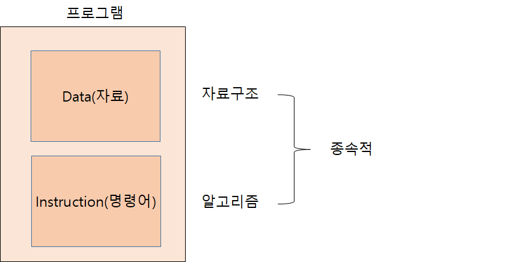

# 01 자료구조와 알고리즘
## 1.1 자료구조와 알고리즘
### 자료구조(data structure)란?
* 사람들이 사물을 정리하는 것과 같이 프로그램에서 자료들을 정리하여 보관하는 여러가지 구조 
* 대부분의 프로그램에서 자료(Data)를 처리하며 이들을 자료구조를 사용하여 저장한다. 
    * 일상생활과 자료구조와 유사성
        * 식당에서 그릇 쌓기 -> Stack
        * 마트 계산대 줄 서기 ->QUEUE
        * 버킷 리스트 차례대로 기록 ->LIST 
        * 영어사전 ->Dictionary
        * 지도에 도시들과 도시 연결하는 도로 표시 ->Graph
        * 컴퓨터의 계층적이 디렉토리 구조 ->Tree

### 알고리즘(Algorithm)이란?
* 컴퓨터로 문제를 풀기위한 단계적인 절차
* 문제 해결하는 방법을 정밀하게 장치가 이해할 수 있는 언어로 기술한 것 
* 즉, 특정 일 수행하는 명령어들의 집합
*알고리즘이 되기 위한 조건
    1. 입력 : 0개 이상의 입력이 존재하여야 함
    2. 출력 : 1개 이상의 출력이 존재하여야 함
    3. 명백성 : 각 명령어의 의미는 모호하지 않고 명확해야 함
    4. 유한성 : 한정된 수의 단계 후에는 반드시 종료되어야 함
    5. 유효성 : 각 명령어들은 종이와 연필, 또는 컴퓨터로 실행 가능한 연산이어야 함
* 알고리즘을 기술 방법
    1. 한글이나 영거 같은 자연어 : 모호성 존재
    2. 흐름도(순서도) : 초심자에게 좋은 방법, 알고리즘이 복잡해지면 기술 어려움
    3. 의사코드 : 자연어보다는 더 체계적이고 프로그래밍언어보다는 덜 엄격한 언어, 기술하는 데만 사용되는 코드, 대입연산자인 '=' 대신 '->'사용함
    4. 프로그래밍 언어 : 모두 명백한 의미를 가지고 있어 알고리즘 기술하는 데 적합함
### 자료구조와 알고리즘
* 컴퓨터 프로그램 = 자료구조+알고리즘

    * ex) 성적의 최고점을 구하는 과정 = 점수 저장하는 배열(자료구조) + 순차 비교하여 최대값 찾는 절차(알고리즘)
* 자료구조가 결정되면 그 자료구조에서 사용 가능한 알고리즘이 결정됨
* 빠르게 저장, 검색, 분석, 전송, 갱신 등을 하기 위해서는 자료구조가 효율적으로 조직화되고 응용 프로그램에 가장 적합한 자료구조, 알고리즘 선택해야 함

## 1.2 추상 자료형
### 자료형 (Data Type)
* 데이터의 종류
    * ex)char, int, double, 배열(동일한 자료형이 여러개), 구조체(다른 자료형이 여러 개 모인 것) 등
* 자료형은 데이터와 실행 가능한 연산을 분리해서 정의 가능
    * ex) int 자료형
        * 데이터 : 컴퓨터에서 나타낼 수 있는 정수의 집합(-INT_MIN...,INT_MAX)
        * 연산 : +,-,*,/,%,==,>,<
### 추상 자료형(ADT : abstract data type)
* 추상적, 수학적으로 자료형을 정의한 것, 구현과 인터페이스를 분리되어 정의한 자료형
* 소프트웨어의 복잡성 대처를 위해 나온 아이디어
* 추상화(abstraction) : 어떤 시스템의 간략화된 기술 또는 명세로 핵심적인 구조와 동작에만 집중, 좋은 추상화는 사용자에게 중요한 정보 강조, 중요하지 않은 구현 세부사항은 제거
* 추상화를 위해 정보은닉기법이 개발되었고 이는 ADT개념으로 발전
* 객체 지향 언어에서는 클래스 개념을 이용해 정의하며 Private 등 키워드 이용해 내부자료 접근을 제한할 수 있다.
* ADT를 프로그래밍 언어로 구현한 것이 자료구조
* ADT의 구조 : 이름부터 시작되며 안에는 이용되는 객체와 함수 정의

## 1.3 알고리즘 성능 분석
### 성능 분석의 중요성
* 상용 프로그램 규모가 이전에 비해 훨씬 커져서 처리해야 할 자료의 양이 많기 때문에 알고리즘의 효율성 중요
* 사용자는 동일한 프로그램에서 더 빠른 프로그램을 선호 함
### 효율적인 알고리즘이란?
* 수행시간이 짧으며 메모리와 같은 컴퓨터 내 자원을 덜 사용하는 알고리즘
### 수행시간 실제 측정 방법
* 알고리즘을 프로그래밍 언어로 작성하여 실제 컴퓨터상에서 실행해서 측정
* 문제점
    1. 복잡한 알고리즘은 구현의 부담
    2. 하드웨어 종류에 따라 효율적인 프로그램 다를 수 있음
    3. 구현 언어에 따라 속도 다를 수 있음
    4. 실험되지 않은 입력에 대해서는 수행 시간 주장할 수 없다
### 알고리즘 복잡도(complexity analysis) 분석방법
* 몇 개의 알고리즘 중 가장 효율적인 것을 골라야 할 때 직접 구현하지 않고 대략적으로 알고리즘 효율성 비교하는 방법으로 구현하지 않고 모든 입력 고려하며, HW/SW 환경과는 관계없이 알고리즘의 효율성 평가 가능하다.
#### 시간 복잡도 함수
* 정의 : 연산의 수를 입력의 개수 n의 함수로 나타낸 것으로 T(n)으로 표기
* 알고리즘이 차지하는 공간보다 수행시간에 더 관심이 있음
* 알고리즘의 절대적인 수행 시간이 아닌 알고리즘을 이루고 있는 연산들이 몇 번이나 수행되는지를 숫자로 표시하는데 일반적으로 입력의 개수(n) 에 따라 변하게 되므로 연산의 횟수는 고정된 숫자가 아닌 n에 대한 함수가 된다
#### 빅오 표기법
* 시간복잡도 함수에서는 보통 차수가 가장 큰 항만 고려하면 충분, 상대적으로 작은 항은 무시가능
* 시간복잡도에서 중요한 것은 n이 증가할 때에 n,n*n에 비례하여 증가하는지, 아니면 다른 증가 추세 가지는 지 등 증가 추세가 중요
* 시간 복잡도 함수에서 불필요한 정보를 제거하여 시간 복잡도를 표시하는 방법, n 값에 따른 함수의 상한 값을 나타내는 방법
* 수학적 정의 : 두개의 함수 f(n) , g(n)이 주어졌을 때 모든 n>n0에 대하여 |f(n)|<=c|g(n)|을 만족하는 2개의 상수 c와 n0가 존재하면 f(n)=O(g(n))
* 많이 쓰는 빅오 표기법
    * O(1)< O(log n)< O(n)< O(n log n)< O(n^2)< O(n^3)< O(2^n)< O(n!)..
* 빅오 표기법 이외의 표기법 : 빅 오메가, 빅세타 표기법 등 존재
#### 최선, 평균 최악의 경우
* 주어진 입력의 집합에 따라 다른 수행시간을 보일 때 알고리즘 효율성을 3가지 경우로 나눠서 표현 가능하다
    * 최악의 경우(worst case)
    * 최선의 경우(best case)
    * 평균의 경우(average case)
        * ex) 순차탐색 
            * 최악 : 마지막에 찾는 경우 O(n) 
            * 최선 : 처음에 찾는 경우 O(1) 
            * 평균 : (1+2+..+n)/n = (n+1)/2 ,즉 O(n)  따라서, O(n)

* 주로 최선의 경우는 알고리즘에서 의미없는 경우가 많아, 최악의 경우를 주로 시간복잡도의 척도로 쓴다.
