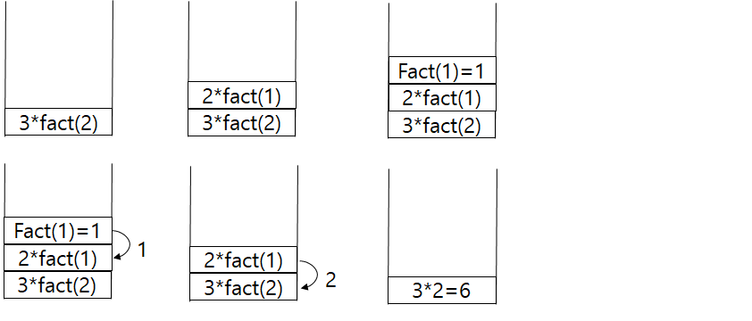

# 02 재귀(Recursion)
## 2.1 재귀의 소개 
### 재귀호출의 정의와 구조
* 재귀(순환) : 어떤 알고리즘이나 함수가 자기 자신을 호출하여 문제를 해결하는 기법
* 호출되는 함수가 자기 자신을 다시 호출하는 것은 다른 함수를 호출하는 것과 같으며 재귀 호출 중첩 될수록 활성 레코드 쌓임
* 호출되는 함수를 위한 함수 종료 후 복귀주소, 매개 변수, 지역 변수를 시스템 스택의 저장 공간인 활성 레코드(activiation record)에 저장
* 호출된 함수가 끝나면 저장된 복귀 주소로 돌아감
    * EX) 팩토리얼 순환 호출
  
    

* FORTRAN, COBOL에서는 재귀 지원하지 않음 
    * 고전적인 언어는 모두 정적변수 할당만 사용하므로
* 정의가 재귀적으로 되어 있는 경우에 유리한 방법 
    *ex) 팩토리얼, 피보나치, 이항계수, 이진트리, 이진 탐색, 하노이 탑 등
### 재귀(Recursion) vs 반복(Iteration)
* 재귀 
    * 가독성이 좋음
    * 반복에 비해 알고리즘 간결하고 명확하게 작성 가능
    * 수행 속도는 함수 호출을 계속 하기 때문에 반복에 비해 느린경우가 많음
* 반복
    * 수행속도가 대부분 재귀보다 빠름

### 재귀 알고리즘의 성능
* 쉽게 프로그래밍 가능한 대신 많은 공간(호출하는 함수 상태 기억)과 수행 시간 잡아먹을 수 있음

### 재귀 알고리즘의 예
1. 거듭제곱값 계산 ([원본](./exp.c))
```
int exp(int x, int n) {//지수를 줄이는데 중점
	if (n == 0)return 1;
	if (n % 2 > 0) return exp(x*x, n / 2)*x;
	else return exp(x*x, n / 2);
}
```
2. 피보나치 수열([원본](./fibonaci.c))
```
int fib(int n) {//재귀를 이용한 fibonaci
	if (n < 2) return n;
	return fib(n - 1) + fib(n - 2);
}
```